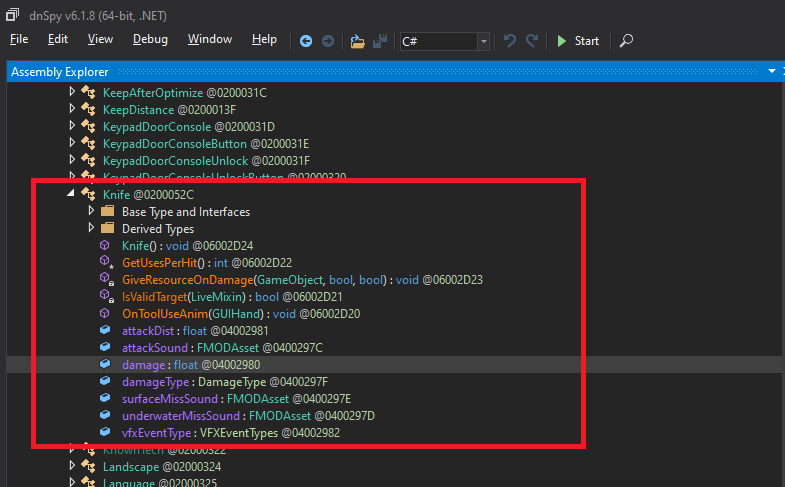

# Exploring the game files

To build our mod, we need to find out some stuff. The goal is to mod the damage of the knife. Some key questions to answer, then:

1. How do we get hold of the knife object?
2. What do we change to effect the damage dealt?

This is where dnSpy comes in. Fire it up from where you installed it. Once it's running, select `File > Open`, navigate to `<game>\SubnauticaZero_Data\Managed\Assembly-CSharp.dll`.

You should see a bunch of stuff down the left hand side of the screen that might look interesting. What you'll see is a list of `Classes` in green. If you expand one of these, you'll see the class `Methods` in orange and you'll see class `Fields` in purple. It's here where we'll find the answers to our questions above.

dnSpy has some brilliant search functionality, so in the search box at the bottom of the screen, change the `Search for` drop down to `class` and enter the word "Knife" and hit return. You should see a class called `Knife` in the left side of the screen, and you can expand it to see it's `methods` and `fields`:

Now, let me just tell you now - it's often not as easy as this! In some ways, you're second guessing the developers here, and hoping they've called their objects something reasonably similar to what you're looking for. This is not always the case - I'm looking at you, SnowFox. Hoverbike my ass...

A couple of things jump out:

1. There's a `Start` method. This is great, as we can hook that method and modify an instance of this class when it's initiated by the game.
2. There's a `damage` field. It's like Christmas has come early, as this is just what we're looking to change!

Again, this is a very simple scenario, and more often than not, it's not as clear-cut or simple. However, ultimately the answer is in there somewhere and time and experience will help you find it quicker and more efficiently, the more you mess around and make mods.

So, if we can hook into the `Start` method, and increase the `damage` value of the `Knife` class instance, we should be in business. Let's see if we're right.