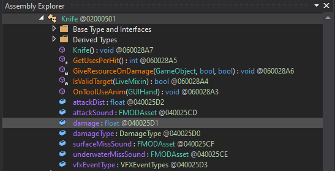

# Exploring the game files

To build our mod, we need to find out some stuff. The goal is to mod the damage of the knife. Some key questions to answer, then:

1. How do we get hold of the knife object?
2. What do we change to effect the damage dealt?

This is where dnSpy comes in. Fire it up from where you installed it. Once it's running, select `File > Open`, navigate to `<game>\Subnautica_Data\Managed\Assembly-CSharp.dll`.

You should see a bunch of stuff down the left hand side of the screen that might look interesting. What you'll see is a list of `Classes` in green. If you expand one of these, you'll see the class `Methods` in orange and you'll see class `Fields` in purple. It's here where we'll find the answers to our questions above.

dnSpy has some brilliant search functionality, so in the search box at the bottom of the screen, change the `Search for` drop down to `class` and enter the word "Knife" and hit return. You should see a class called `Knife` in the left side of the screen, and you can expand it to see it's `methods` and `fields`:

So, this looks promising! There's a float attribute called `damage` that looks like it could come in handy, as this looks like the value that will determine how much damage is done to a target when the knife is used.

But there's a catch: all Unity classes inherit from a class called `MonoBehaviour`. This base class has two incredibly useful methods:

`Start` - this is called when an object is loaded and initialised into the scene

`Awake` - this is called right before `Start`, and is called even if the component is disabled

So, either are prime places to hook our code and make some changes. The catch here? Neither `Start` or `Awake` are overriden by custom code, so we can't use Harmony to patch the `Knife` object directly.

But don't despair! If you expand the `Base Type and Interfaces`section of the object in dnSpy, you'll see that `Knife` inherits from a class called `PlayerTool`. If you double click that class in the assembly explorer, you'll see the methods and attributes for this class:

And lo and behold, we have an `Awake` method that we can hook.

Hurrah! We have what we need to make our mod!