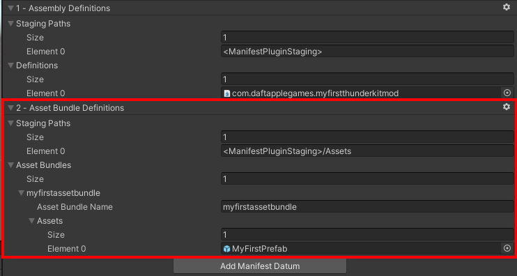
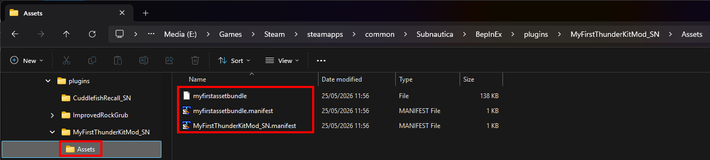

# Creating an asset bundle

Asset Bundles are just containers for assets that you want to include in your mod. ThunderKit allows you to set up Asset Bundles directly by configuring your mod ThunderKit asset.

!!! warning "Warning"

    Do not create or allocate Asset Bundles using the standard Unity Editor functionality. ThunderKit manages Asset Bundles directly, under the hood, so that you don't have create and manage Asset Bundles in Unity yourself.

We need to add an Asset Bundle to our ThunderKit project:

1. Select your ThunderKit asset in the Project tab.
2. In the inspector, you might already see an "Asset Bundle" definition entry. If you do, click the little gear icon on the right of that entry and select "Remove" - we want to go through the whole process of adding our own.
3. Still in the Inspector, click "Add Manifest Datum" and double click "Asset Bundle Definitions".
4. Under "Staging Paths", increase the size to 1 to add a new entry.
5. In that new entry, "Element 0", specify the asset staging path: `<ManifestPluginStaging>/Assets`. This will create an "Assets" folder within our mod plugin folder where the asset bundle will be deployed.
6. Under "Asset Bundles", increase the size to 1 to add a new entry.
7. In that new entry, "Element 0", specify our new Asset Bundle: `myfirstassetbundle`.
8. Under "Assets", increase the size to 1 to add a new entry.
9. Drag "MyFirstPrefab" asset from the "Project" tab onto the "None (Object)" field of "Element 0".
10. That tells ThunderKit to create this Asset Bundle and include the assets that you add.
11. To add more, increase the size of the array and drag your assets into the corresponding new fields.
12. Your asset bundle definition should look like this:
13. In the ThunderKit quick access toolbar, select your "Build and Deploy" task and your "MyFirstThunderKit" mod asset, and hit "Execute".
14. Go into Windows Explorer, and navigate to the `plugins` folder in your Subnautica game folder.
15. Within that, you'll find "MyFirstThunderKitMod/Assets", and within that you'll find your exported Asset Bundles:
16. If you want, you can double click the `myfirstassetbundle.manifest` file and have a look at it. You should see your prefab listed, something like this:

    ```
    SerializeReferenceClassIdentifiers: []
    Assets:
    - Assets/Mods/MyFirstThunderKitMod_SN/Prefabs/MyFirstPrefab.prefab
    Dependencies: []
    ```

Nice, now all we have to do is load the asset bundle, grab the prefab and instantiate an instance in our game.

