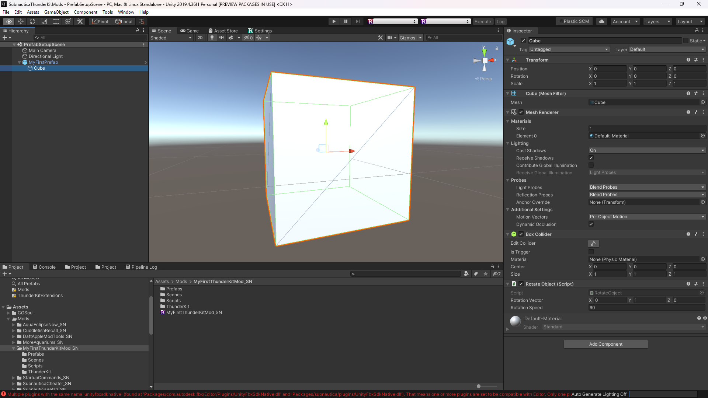

# Creating Custom Prefabs

One of the most useful features that Unity and Thunderkit has to offer is allowing you to create custom prefabs, and instantiating instances of them in the games.

We've already talked about what prefabs are, but how do you create your own for use in your mods?

It's easy using ThunderKit and the Unity editor.

## Creating your Game Object

1. In your ThunderKit project, create folders called "Scenes" and "Prefabs".

2. Create a new scene - call it something like "PrefabSetupScene" - and save it in the "Scenes" folder.

3. Within the scene, right click and create a new Game Object called "MyFirstPrefab". Set it's transform to `(0, 0, 0)`.

4. We'll add a model, using a simple cube for testing purposes. So right click the Game Object and select "3D Object > Cube".

5. Double click the cube Game Object to zoom into it in the Scene view.

6. In the Scripts folder of your project, right click and select "Create  > C# script". Call it "RotateObject".

7. Double click the script to open it in Visual Studio or Rider, or whatever you've configured.

8. Paste in this code:

    ```csharp
    using UnityEngine;
    
    namespace DaftAppleGames.MyFirstThunderKitMod
    {
        public class RotateObject : MonoBehaviour
        {
            public Vector3 rotationVector = Vector3.up;
            public float rotationSpeed = 90f;
    
            void Update()
            {
                transform.Rotate(rotationVector * rotationSpeed * Time.deltaTime);
            }
        }
    }
    ```

    This code simply rotates the cube Game Object about it's "y" axis every frame.

9. Save the script and drag it onto your cube.

10. Click the Main Camera and set it's transform to something like `(0, 0, -2)`, just so you can see the cube when your run the scene.

11. Your Unity project should look something like this:

12. Click Run and you'll see your cube rotating nicely.

13. Click Stop.

14. Still on the `cube` Game Object, click "Add Component" and start typing the word "Apply".

15. Pick the component called "Apply SN Shaders" and add it to the Game Object.

    !!! tip

        You can start to see how powerful custom prefabs are here: as well as being able to add your own components, you can add Nautilus, Unity and game components too, all without complex scripting. This component will automatically apply Subnautica's own custom shader to all materials on your Game Object, making them render nicely within the game.

16. Now drag the entire "MyFirstPrefab" Game Object from the Hierarchy to the "Prefabs" project folder.

17. The object name and icon will turn blue, showing you it's now a prefab.

That's it! Now let's get this into an asset bundle, and spawned in the game.

