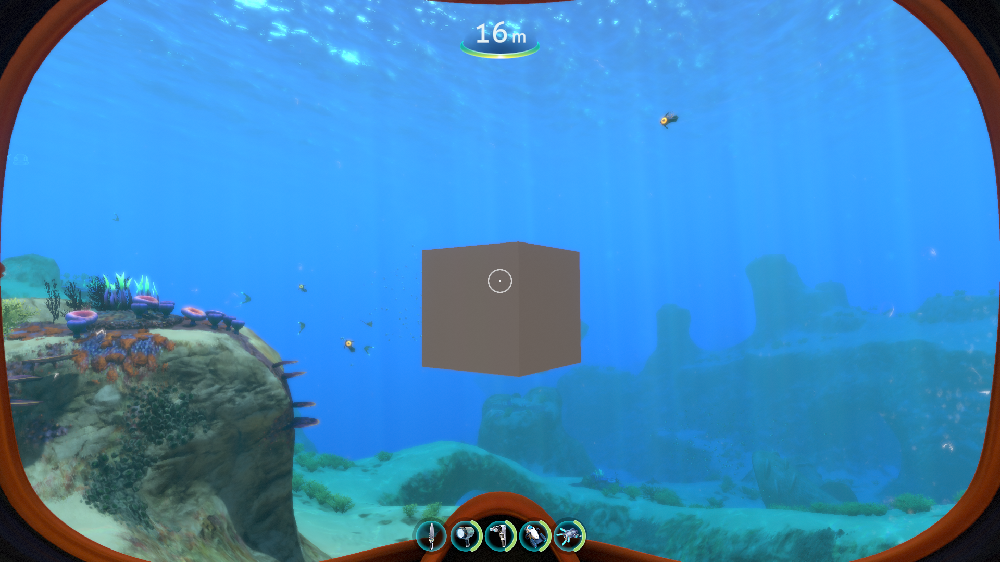

# Spawning Prefab Instances

We need some code in our mod to load our prefab from our asset bundle and instantiate it in the game.

!!! tip

    Nautilus has some handy APIs that greatly simplify this process. You can find details in the [Nautilus documentation](), which also goes on to explain how to use Asset Bundles and assets in your own Subnautica custom prefabs. Using Nautilus is recommended, whether you're a beginner or advanced modder, as it just makes life easier for you and for others who might be looking at your mod code in the future.

To demonstrate that our Asset Bundle is good, let's use Nautilus to spawn an instance of our new prefab when the player spawns.

1. In your existing `MyFirstThunderKitMod` project, open the `MyFirstThunderKitModPlugin.cs` file.

2. Add this code just under the existing `const` declarations:

    ```csharp
    private const string MyGuid = "com.daftapplegames.myfirstthunderkitmod";
    private const string PluginName = "MyFirstThunderKitMod";
    private const string VersionString = "1.0.0";
    
    // *** Asset Bundle code here ***
    private const string AssetBundleName = "myfirstassetbundle";
    // Maintain a static reference to AssetBundle, so it can be used throughout your mod code
    public static AssetBundle MyAssetBundle { get; private set; }        
    ```

    !!! tip

        The Nautilus Asset Bundle API automatically looks in the "Assets" subfolder of your mod, so you only need to specify the bundle name.

3. Now add this code in the existing `Awake` method, just before the `Logger.LogInfo($"Welcome to my first ThunderKit Plugin!");` line:
    ```c#
    ModLogger.LogInfo($"PluginName: {PluginName}, VersionString: {VersionString} is loaded.");

    // Use the Nautilus API to load the Asset Bundle
    ModLogger.LogInfo($"Loading AssetBundle from {AssetBundleName}...");
    MyAssetBundle =
       AssetBundleLoadingUtils.LoadFromAssetsFolder(Assembly.GetExecutingAssembly(), AssetBundleName);
    if (!MyAssetBundle)
    {
       ModLogger.LogInfo($"Failed to load AssetBundle from {AssetBundleName}! Check the path!");
    }
    ModLogger.LogInfo($"Asset Bundle Loaded!");

    ModLogger.LogInfo($"Welcome to my first ThunderKit Plugin!");
    ```

    This uses the Nautilus API to load the AssetBundle and stores a static reference to it that we can refer to elsewhere in our mod.

4. Now, create a new C# Script and call it `PlayerPatches`. Paste in this code:

    ```c#
    using HarmonyLib;
    using UnityEngine;

    namespace DaftAppleGames.MyFirstThunderKitMod
    {
       /// <summary>
       /// Class to implement Harmony patches on the Player class
       /// </summary>
       [HarmonyPatch(typeof(Player))]
       internal class PlayerPatches
       {

           // Postfix patch on the Awake method
           // Spawn a prefab instance when the player is spawned
           [HarmonyPatch(nameof(Player.Awake))]
           [HarmonyPostfix]
           public static void Awake_Postfix(Player __instance)
           {
               MyFirstThunderKitModPlugin.ModLogger.LogInfo($"Spawning Prefab instance...");

               // Get prefab from Asset Bundle then spawn an instance in front of the player
               GameObject myPrefab = MyFirstThunderKitModPlugin.MyAssetBundle.LoadAsset<GameObject>("MyFirstPrefab.prefab");
               MyFirstThunderKitModPlugin.ModLogger.LogInfo($"Found prefab in Asset Bundle. Creating instance...");
               GameObject newPrefabInstance = Object.Instantiate(myPrefab, __instance.transform, true);
               // Move the transform to 2 units in front of the player
               newPrefabInstance.transform.localPosition = Vector3.zero + __instance.transform.forward * 2;
               // Scale the instance - you could also set the scale in your prefab in Unity
               newPrefabInstance.transform.localScale = new Vector3(0.5f, 0.5f, 0.5f);
               newPrefabInstance.name = "MyNewPrefabInstance";

               MyFirstThunderKitModPlugin.ModLogger.LogInfo($"Prefab instance spawned!");
           }
       }
    }
    ```

    This Harmony patch code will fire when the player Game Object is spawned, and will load your new prefab from the asset bundle, instantiate an instance of it, and attach it just in front of the player.

6. "Build and Deploy" the mod, with your new changes, and launch the game.

7. Load a saved game and you should see your rotating cube in front of you:

This just gives you an idea of how easy it is to create Asset Bundles and use them to introduce prefab instances into the game. Typically, you would not want to instantiate instances directly like this, and you should refer to the Nautilus documentation for [adding new content into the game](https://subnauticamodding.github.io/Nautilus/tutorials/spawns.html) for details on how best to go about it.

